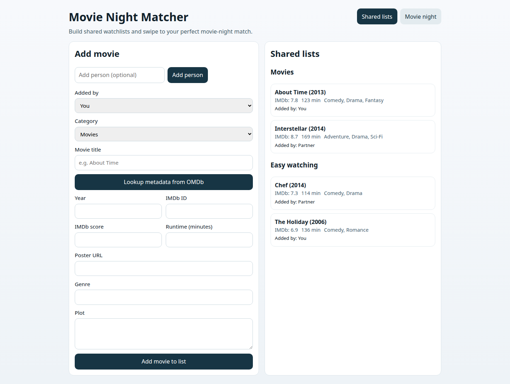
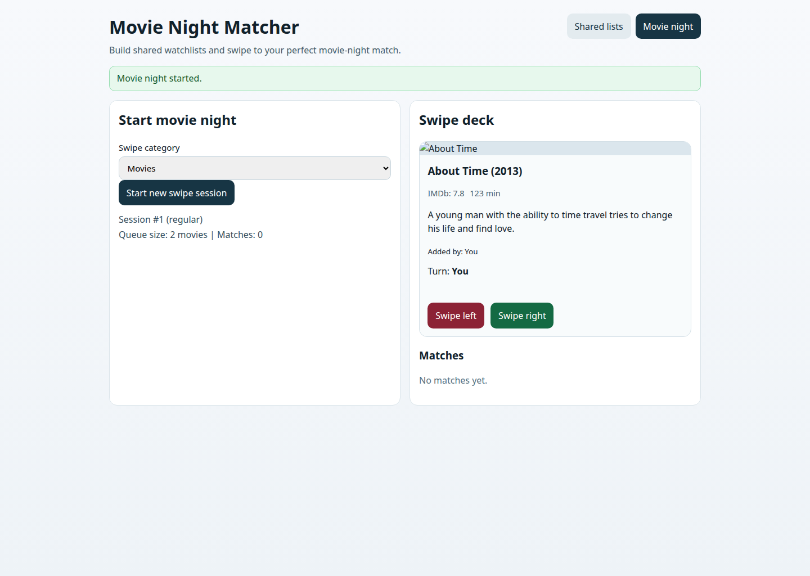
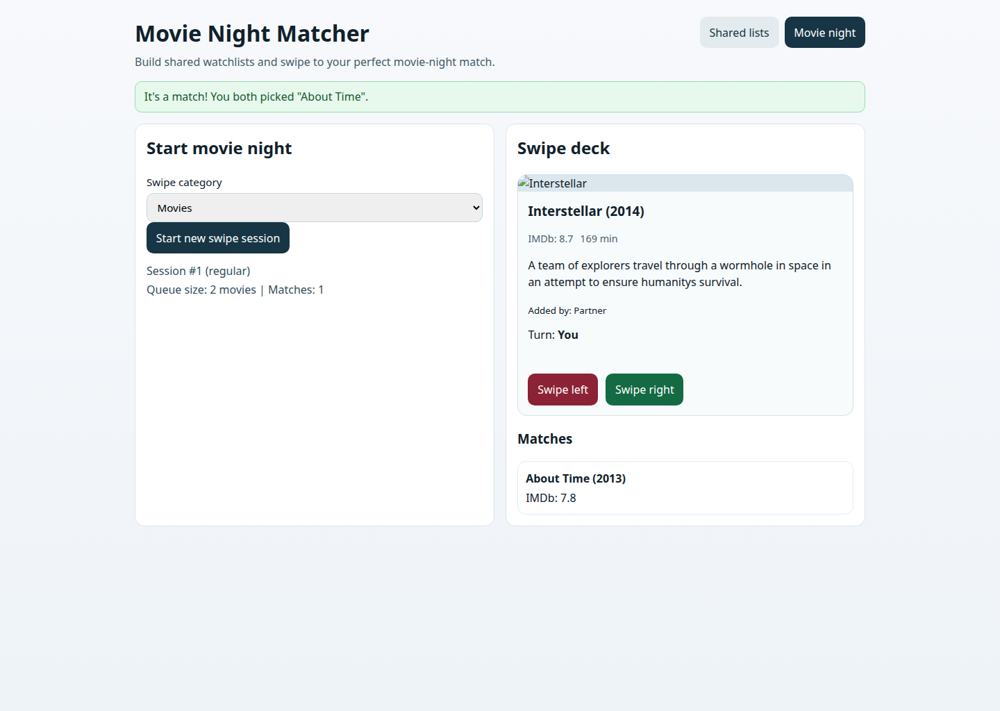

## Movie Night Matcher

A full-stack web app for couples (or friends) to:

- Add movies to a shared list in two categories:
  - **Movies** (regular)
  - **Easy watching**
- Store metadata like IMDb score, runtime, genre, and plot
- Start a movie-night swipe session (Tinder-style yes/no flow)
- Get an automatic **match** when both people like the same movie

---

### UI preview

#### Shared lists


#### Movie night swipe


#### Match state


---

### Tech stack

- **Frontend:** React + Vite
- **Backend:** Node.js + Express
- **Persistence:** [JSONBlob](https://jsonblob.com/) (hosted JSON document store)

---

### Project structure

- `web/` – React frontend
- `server/` – Express API + JSONBlob-backed persistence

---

### Local setup

1. Install dependencies (already done once in this repo):

   ```bash
   npm install
   npm install --prefix server
   npm install --prefix web
   ```

2. Configure backend environment:

   ```bash
   cp server/.env.example server/.env
   ```

3. Configure JSONBlob persistence in `server/.env`:

   - Option A (recommended): set an existing blob id

     ```env
     JSONBLOB_ID=your_blob_id
     ```

   - Option B: set full blob URL

     ```env
     JSONBLOB_URL=https://jsonblob.com/api/jsonBlob/your_blob_id
     ```

   If neither value is set, the server auto-creates a new blob on first start and logs the URL/id to reuse.

4. (Optional) Add an OMDb key to `server/.env` for auto metadata lookup:

   ```env
   OMDB_API_KEY=your_key_here
   ```

   Without this key, you can still add movie metadata manually.

5. Start frontend + backend:

   ```bash
   npm run dev
   ```

   - Frontend: `http://localhost:5173`
   - Backend API: `http://localhost:4000`

---

### Core flows

#### 1. Build shared lists
- Choose who is adding a movie
- Pick category (`Movies` or `Easy watching`)
- Enter title and (optional) auto-fetch metadata from OMDb
- Save movie into the selected shared category

#### 2. Run movie night swipes
- Start a new session in one category
- Pass the device between users for each card
- Swipe left/right (No/Yes)
- If both users swipe right on the same movie, it appears in **Matches**

---

### API quick reference

- `GET /api/users`
- `POST /api/users`
- `GET /api/library`
- `POST /api/library`
- `POST /api/movies/lookup`
- `POST /api/sessions/start`
- `GET /api/sessions/:sessionId/state`
- `POST /api/sessions/:sessionId/swipe`
- `GET /api/sessions/:sessionId/matches`

---

### Notes

- Default seeded users are `"You"` and `"Partner"` (configurable via `DEFAULT_USERS`).
- Data is stored remotely in JSONBlob (no local DB process required).

---

### GitHub Pages deployment

- This repo includes a workflow at `.github/workflows/deploy-pages.yml` that deploys the `web/` app to GitHub Pages on pushes to `main`.
- The site URL will be:
  - `https://kokarn.github.io/movie-night/`
- For API calls in production, set a repository variable named `VITE_API_BASE_URL` (for example your deployed backend URL).  
  If unset, the frontend uses relative `/api` paths (works for local dev with the Vite proxy).

---

### Backend container publish (GHCR)

- This repo includes a workflow at `.github/workflows/push-backend-ghcr.yml` that builds and pushes the backend image to GitHub Container Registry (GHCR) on pushes that touch `server/**`.
- Image name:
  - `ghcr.io/<owner>/<repo>-backend`
- Published tags:
  - `sha-<commit-sha>`
  - `<branch-name>`
  - `latest` (default branch only)
